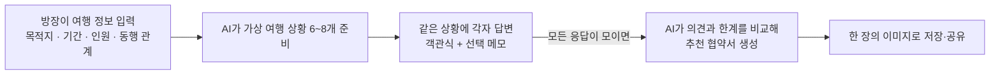

# IDEA: 여행 동행 협약서

프로젝트 방향을 공유하는 기획 메모이다.

여행 전에 같은 상황에 각자 답하고, 일행의 의견 차이와 조정 방법을 한 장의 추천 협약서로 확인한다. 기존 [Job Story](docs/research/interviews.md)의 상황별 입장 확인과 일정 조정을 여행 전 체험으로 옮긴 아이디어이다. 실제 여행에서 표현과 조율에 도움이 되는지는 검증할 가설이다.

## 사용자 흐름

1. 방장이 목적지·기간·인원·동행 관계를 입력한다.
2. AI가 여행 조건에 맞는 상황 6~8개를 선정·각색한다.
3. 방장과 초대받은 일행이 같은 상황에 독립적으로 답한다. 응답 중에는 다른 사람의 답을 보여주지 않는다.
4. 모든 응답이 모이면 AI가 선택과 메모를 비교해 추천 협약서를 만든다.
5. 협약서를 한 장의 이미지로 저장·공유한다.

## 질문

- 사람이 인터뷰를 바탕으로 문항 pool을 준비한다. 문항의 목적·핵심 제약·선택지 의미를 정하고, AI는 여행 조건에 맞게 문항을 고르고 표현을 각색한다.
- 짧은 여행 장면에서 본인이 원하는 행동을 묻는다. 취향·체력·감정을 미리 정하거나 착한 답을 유도하지 않는다.
- 활동과 휴식, 함께·따로 움직이기, 추가 지출, 일정 변경 등을 다룬다. 선택이 다르다는 이유만으로 갈등으로 판단하지 않는다.
- 응답은 객관식과 선택 메모이다. 필요한 경우 ‘어느 쪽이든 괜찮음’, ‘다른 의견’, ‘정보가 더 필요함’을 제공한다.
- 선택의 이유, 조정 가능한 조건, 받아들이기 어려운 한계를 확인한다. 응답하지 않은 내용은 추측하지 않는다.

## 추천 협약서

- 가상 장면에 대한 응답을 바탕으로, 비슷한 상황에서 일행이 사용할 조율 방법을 추천한다. 가상 장면의 예약·일정·금액을 실제 여행 사실로 옮기지 않는다.
- 조항에는 적용할 상황과 행동, 필요한 조건이 드러나야 한다. 함께 행동하기, 시간 나누기, 별도 행동, 기존 일정 유지 등을 검토한다.
- 메모가 객관식 선택을 명확히 수정·제한하면 메모를 우선한다. 의도는 원문이 뒷받침하는 범위에서 해석하며, 모호하거나 모순된 내용은 확인한다.
- 다수 의견이나 방장이라는 이유로 개인의 명시적 한계를 무시하지 않는다. 한계를 완화해야 가능한 안은 조건부 대안으로 구분한다.
- 입력에 없는 시간·장소·절차는 AI의 제안값이다. 참여자가 이미 수락했거나 실행한 사실로 표현하지 않는다.
- 정보가 부족한 경우와, 검토한 범위에서 중재안을 찾지 못한 경우를 구분한다. 후자에는 이유 설명과 함께 유머 문구를 표시할 수 있다. 사람의 성격·궁합이나 여행 실패를 판정하지 않는다.

결과는 ‘여행 동행 협약서’라는 종이 문서 형태로 보여준다. 종이가 펼쳐지고 붉은 도장이 찍히는 연출을 구상한다. 도장은 ‘추천안 발급’으로 표시하며, 어떤 응답을 반영했는지 확인할 수 있게 한다.

## 아직 정할 것

- 서비스에 사용할 API 제공자·모델과 선정 후 호출 비용

- 전원 수락 절차와 방장의 직접 편집 권한 등 결과 생성 이후의 흐름
- 개별 선택·메모·이름의 공개 범위와 응답 완료 알림, 미응답·응답 수정 처리
- 문항 각색의 허용 범위와 선정 기준, 메모만으로 수용 범위를 충분히 파악할 수 있는지

현재 출력 형식과 처리 규칙은 [질문 선정·각색](src/travel/prompts/prepare_scenarios.md), [추천 협약서 생성](src/travel/prompts/generate_pact.md)에 있다.
