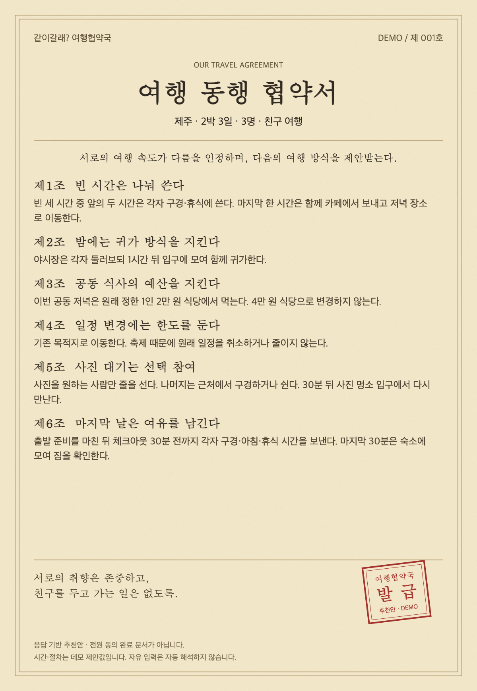

# 2026-09-23 회의록

회의 당시의 논의·결정·진행 상태를 보존한 기록. 현재 제품 기준은 [SPEC](../SPEC.md) 참조.

## 기획

여행 전 현실적인 여행 상황에 답해보고, 우리 일행의 의견이 갈리는 지점과 구체적인 조정 방법을 한 장의 재미있는 여행 협약서로 확인한다.

- 결과는 “대화로 해결하세요”에서 끝내지 않는다. 언제, 누가, 어떻게 행동할지 알 수 있는 대안을 제시한다.
- 질문에 답한 보상으로 종이 질감의 협약서 한 장이 나오고 마지막에 도장이 찍히는 경험을 만든다. 이미지를 저장해 일행과 공유할 수 있게 한다.
- 별도의 최종 동의 단계는 추가하지 않는 방향이다. ‘합의문’이라는 형식은 살리되, 실제로는 응답을 바탕으로 만든 추천 협약임을 구분한다.

## 사용자 흐름

1. 방장(가칭)이 목적지·기간·인원·동행 관계(친구, 가족, 연인 등)를 입력한다.
2. AI가 여행 조건에 맞는 상황 6~8개를 준비한다.
3. 방장이 각 상황에서 본인이 원하는 행동과 의견을 입력한다.
4. 초대 링크를 다른 여행자에게 전달한다.
5. 다른 여행자도 같은 상황에 독립적으로 답한다.
6. 모든 응답이 모이면, 공통 의견과 차이를 바탕으로 AI가 구체적인 여행 협약서를 만든다.
7. 도장이 찍힌 협약서를 확인하고 한 장의 이미지로 저장·공유한다.

- 응답 완료 후 방장에게 알릴지, 어떤 방식으로 알릴지는 미정이다.

## 질문 설계

### 질문으로 알아내려는 것

- 그 상황에서 각자가 원하는 행동.
- 그 선택에서 중요하게 여기는 부분과 이유.
- 양보하거나 조정할 수 있는 조건, 받아들이기 어려운 한계.
- 선택이 다르다는 이유만으로 갈등이라고 판단하지 않는다. 서로 받아들일 수 있는 차이인지도 봐야 한다.
- 객관식과 선택 메모만으로 모든 사람의 수용 범위를 알 수는 없다. 응답하지 않은 이유·조건은 추측하지 않는다.

### 질문을 만드는 방식

- 사람이 인터뷰를 바탕으로 상황 pool을 만들고, AI가 여행 조건에 맞는 것을 선정한다.
- 현재 유력안은 질문의 핵심 구조는 사람이 정하고 AI가 세부 이야기를 각색하는 방식이다.
    - 사람이 정할 것: 문항의 목적, 선택이 필요한 상황, 핵심 제약, 선택지의 의미.
    - AI가 바꿀 것: 목적지·기간·인원에 맞는 배경, 대사, 표현.
- 질문 전문을 고정할지, 각색 범위를 어디까지 허용할지는 실험 후 정한다. 같은 주제를 반복해서 묻지 않도록 문항 구성을 조정한다.

### 질문의 느낌과 내용

- 짧은 여행 장면 → 선택이 필요한 순간 → 내가 원하는 행동으로 구성한다.
- “너는 액티비티를 좋아한다”처럼 사용자의 취향을 미리 정하지 않는다.
- “친구에게 뭐라고 말할래?”는 표현 방식을 묻게 된다. 상대를 배려하느라 말하지 못하는 바람을 알아내려면 “너는 어떻게 하고 싶어?”를 묻는다.
- 상황 안에서 누가 무엇을 원하는지 미리 정하기보다, 같은 장면에 대한 일행의 답을 모아 차이를 찾는다.
- 정답이나 착한 답이 보이는 문항은 피한다. 각 선택에는 납득할 이유와 포기하는 것이 있어야 한다.
- 주요 소재: 활동과 휴식, 함께·따로 움직이기, 추가 지출과 예산, 일정 변경과 즉흥 선택.

### 응답 형식

- 객관식 의견 선택 + 주관식 이유·조건 입력(선택 사항).
- 필요에 따라 ‘어느 쪽이든 괜찮음’, ‘다른 의견’, ‘정보가 더 필요함’을 제공한다.
- 본인이 응답하는 동안 다른 사람의 답은 보여주지 않는다.
- 개별 답변과 메모를 누구에게 어디까지 공개할지는 별도로 정한다. 결과가 공유된다는 사실 때문에 여기서도 눈치를 볼 수 있다는 점을 고려한다.

### 문항 예시 — 갑자기 비어버린 세 시간

점심을 먹고 나왔는데 오후에 가려던 곳이 갑자기 문을 닫았다. 저녁 약속까지 세 시간. 주변에는 구경할 거리도, 카페도 있고 숙소도 가깝다.

너는 이 시간을 어떻게 보내고 싶어?

- 근처에서 가볼 만한 곳을 찾아 구경하고 싶다.
- 카페에서 먹고 이야기하며 보내고 싶다.
- 숙소에서 쉬거나 내 시간을 보내고 싶다.
- 특별히 원하는 건 없다. 어느 쪽이든 괜찮다.
- 다른 생각이 있다 / 정보가 더 필요하다.

선택 메모: “한 시간만 혼자 쉬면 저녁엔 같이 잘 놀 수 있어.”

이 문항에서 확인할 것은 구경·휴식의 선택뿐 아니라, 밖에서 보내는 시간·혼자 회복하는 시간·함께 이야기하는 시간 중 무엇이 중요한지다. 메모가 없으면 그 이유는 알 수 없는 상태로 둔다.

## 협약서 도출 방향

- 문항별로 일행의 선택과 이유·조건을 비교한다.
- 공통 선택은 해당 장면의 운영안에 반영한다.
- 의견이 갈리면 다수 의견을 참고하되, 소수 의견의 이유와 제약을 함께 반영해 AI가 구체적인 중재안을 제안한다.
    - 다수결로 예산·체력 등의 명시적인 한계를 무시하지 않는다.
    - 함께 행동하기, 시간 나누기, 별도 행동, 기존 일정 유지 등을 조합한다.
    - 방장이라는 이유로 의견의 비중을 더 높이지 않는다.
- 조항은 상황 → 행동 → 필요한 조건이 드러나도록 쓴다. “서로 배려한다”, “대화해본다”만으로 끝내지 않는다.
- 입력에 없는 시간·절차를 구체화했다면 AI의 제안값이다. 이미 모두가 동의한 사실처럼 쓰지 않는다.
- 명시된 조건을 동시에 만족하는 대안이 없을 때의 처리 방식은 추가 결정이 필요하다. 어떤 경우에도 응답과 모순되는 합의를 만들어내지는 않는다.
- 기존에 나온 “그냥 가지 마 ㅋㅋ”는 바이럴 문구 후보로 남긴다. 사람의 궁합이나 여행 실패를 판정하기보다 이번 응답에서 어떤 여행 방식이 충돌하는지를 설명하는 데 사용한다.

### 구체적인 조항 예시 — 최종 생성 규칙은 미확정

- 빈 세 시간 중 앞의 두 시간은 각자 구경·휴식에 쓰고, 마지막 한 시간은 함께 카페에서 보낸다.
- 공동 저녁은 원래 정한 1인 2만 원 식당에서 먹는다. 비용 부담이 있는 사람이 있으면 4만 원 식당으로 변경하지 않는다.
- 사진을 원하는 사람만 줄을 선다. 나머지는 근처에서 구경하거나 쉬고, 30분 뒤 입구에서 다시 만난다.
- 위 시간·금액은 장면과 조항의 예시다. 실제 응답에 ‘따로 움직이기 불가’ 같은 조건이 있다면 해당 대안을 그대로 적용하지 않는다.

## 결과 화면과 공유

### 합의서 예시

- 파피루스·오래된 종이 느낌의 바탕 + 짙은 글자 + 붉은 도장으로 실제 서류 같은 한 장을 만든다.
- 문서 제목은 ‘여행 동행 협약서’처럼 정하고, 목적지·기간·인원과 제1조~제6조 형태의 행동 규칙을 담는다.
- 본문은 구체적으로 쓰고, 제목·도장·짧은 문구에서 재미를 준다.
- 종이가 펼쳐진 뒤 마지막에 도장이 찍히는 연출을 넣는다.
- 도장은 ‘전원 합의 완료’ 대신 ‘추천안 발급’처럼 실제 상태에 맞게 표시한다.
- 주요 동작은 이미지 저장·공유. 상세한 응답 비교는 ‘어떤 응답이 반영됐나요?’에서 펼쳐 본다.

## 인터뷰·Job Story·온톨로지와의 연결

- 기존 방향인 상황별로 중요한 것을 확인하고 조정안을 찾는 과정을 여행 전 체험으로 옮긴다.
- 상황별 입장과 조정안은 기존 온톨로지와 연결할 수 있다. 자동 생성한 추천안을 참여자가 실제로 선택한 결정으로 기록하지 않는다.
- 고정적인 성격·궁합 판정은 현재 근거와 범위에서 벗어난다.
- 사전 응답과 재미있는 협약서가 더 솔직한 표현이나 실제 여행 조율에 도움이 되는지는 아직 검증할 가설이다.

## 목업으로 확인한 범위

- 여행 정보 입력 → 6개 상황 응답 → 친구 응답 대기 → 협약서 결과 → PNG 저장 흐름을 구현했다.
- 결과를 긴 분석 카드에서 종이 협약서 한 장으로 바꾸고 도장 연출을 적용했다.
- 현재는 로컬 목업이다. 친구 응답은 가상 예시이며, 조항은 객관식 선택에 따라 바뀌는 예시 규칙으로 만든다.
- 실제 LLM, 다중 사용자 초대·응답 수집, 완료 알림은 연결하지 않았다. 주관식 조건도 자동 해석·반영하지 않는다.
- 목업의 화면·저장 동작 확인과 실제 AI 중재 품질 검증은 구분한다.

## 당시 정해야 하는 일

- 협약서 생성 기준: 다수 의견과 개인 제약의 우선순위, 동률·조건 충돌·정보 부족 처리, 제안값을 정하는 기준.
- 질문 생성 범위: 전문 고정과 AI 각색의 범위, 문항 선정·중복 방지 기준, 주제별 구성.
- 응답 정보: 선택 메모만으로 충분한지, 수용 범위를 추가로 물어야 하는지.
- 공개 범위: 개별 선택·메모·이름의 노출 범위와 입력 전 안내.
- 서비스 흐름: 방장 명칭, 응답 완료 알림, 미응답자·응답 수정 처리.
- 바이럴 표현: 재미있는 경고 문구의 수위와 구체적인 조정안을 함께 보여주는 방식.

## 당시 할 일

1. 3주차 구조화 출력
    - 질문 선정·각색 결과의 출력 형식을 정한다.
    - 협약서 조항, 근거 응답, 제안한 조건, 미해결 조건을 구분할 출력 형식을 정한다.
2. 문제정의
    - 인터뷰와 Job Story를 바탕으로 해결할 문제와 범위를 정리한다.
    - 여행 전 체험이 실제 표현·조율에 도움을 준다는 부분은 검증할 가설로 둔다.
3. 스펙
    - 현재 사용자 흐름, 질문·응답 형식, 협약서 생성 기준과 수용 기준을 문서화한다.
    - AI로 초안을 작성하더라도 미정인 정책은 팀에서 결정한다.
4. 스파이크
    - 3주차 구조화 출력을 활용해 질문 생성과 협약서 생성을 작은 범위로 검증한다.
    - 정상 응답 외에 의견 불일치, 소수자의 불가 조건, 객관식과 메모의 충돌, 정보 부족 사례를 넣는다.
    - 형식 준수뿐 아니라 구체적인 대안 제시, 응답 조건 보존, 근거 없는 합의 생성 여부를 확인한다.
    - 동일 입력에서 결과의 변동, 응답 시간·비용을 기록한다.
5. 목업 사용자 확인
    - 질문이 본인의 바람을 드러내기 쉬운지, 협약서가 실제로 쓸 만한지 확인한다.
    - 재미있어서 공유하는 데서 끝나는지, 차이를 이해하거나 여행 방식을 정하는 데 이어지는지 확인한다.
